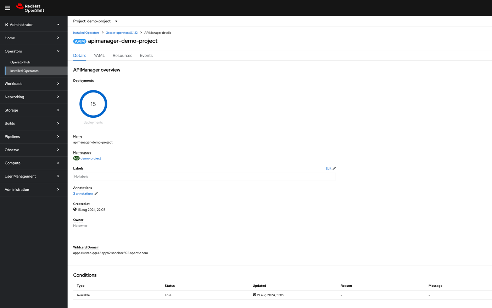

https://github.com/3scale/3scale-operator/blob/master/doc/operator-backup-and-restore.md

# 3scale Installation
Red Hat 3scale API Management is an API Gateway, which makes it easy to manage your APIs. 
Share, secure, distribute, control, and monetize your APIs on an infrastructure platform built for 
performance, customer control, and future growth. Place 3scale components on-premise, 
in the cloud, or on any combination of the two.
More information can be found over here:
* [What is Red Hat 3scale API Management?](https://developers.redhat.com/products/3scale/overview?source=sso)
* [Red Hat 3scale API Management](https://www.redhat.com/en/technologies/jboss-middleware/3scale)

## Storage requirements
As 3scale requires a "ReadWriteMany" capable persistent volume, and as I try to make this repo as much 
platform independent as possible (i.e., no AWS or Azure or ... specific configurations), I opted for 
a local Minio (S3) storage solution to provide me such a storage class. So in order to continue with this
installation, make sure that [Minio is installed properly](README-InstallMinio.md).

## Installation of 3scale
### Install the operator
Installing the operator is nothing more than applying the operator definition, which
you can find at [](gitops/3scale/3scale-operator.yaml). When applied, you should wait until 
it becomes ready, which can take a couple of minutes.

### Install the API manager
Before we install the API manager, some secrets/configurations need to be created in 
OpenShift. So first apply the following files:
* [gitops/3scale/3scale-secret-registry-auth](gitops/3scale/3scale-secret-registry-auth.yaml): contains
a token to be able to access the internal container registry (e.g., for pulling the APICast images).
* [gitops/3scale/3scale-storage-credentials.yaml](gitops/3scale/3scale-storage-credentials.yaml): contains
some values in order to connect with our Minio service.
* [gitops/3scale/3scale-storage-config.yaml](gitops/3scale/3scale-storage-config.yaml): contains 
some values in order to connect with our Minio service. This one could be merged in the previous one if wanted.

Now that we have the configurations in place, we can create the API manager, by applying the following yaml definition:
[gitops/3scale/3scale-api-manager.yaml](gitops/3scale/3scale-api-manager.yaml). When applied, you should wait until
it becomes available, which can take a couple of minutes.
 

## Configure 3scale tenant
In order to have demo data available in 3scale, we will create and populate a demo tenant.
As I want to have this repository as platform independent as possible and hence I want to avoid 
you to install too many tools locally, I avoided the 3scale CLI by dumping the database after population 
myself. Running the script [scripts/script_configure_3scale.sh](scripts/script_configure_3scale.sh) would
create the required demo tenant via a database restore (a shortcut to make the work a bit more efficient).
**!!! important to note:** I am making use of version 2.14 for now (e.g., to have database schemas in sync).

In case you would like to do it manually yourself:
1. Create a tenant "Demo Organization" on the master.
2. Add a user/admin: 3scale-user - 3scale-user@demo-organization.com - pwd: rescale.
3. Activate the user.

4. Impersonate via the master or login in the admin screen with the created user.
_Route should look like this: https://demo-organization-admin.apps.cluster-475kf.475kf.sandbox268.opentlc.com_
5. Create a backend "API backend".
6. Create a product "Product A".
7. Create an API spec for Product A, by going to products > product A > active docs > create a new spec
   1. Fill in name "Product Family 1".
   2. Enable "publish".
   3. Link it to Product A when asked for.
   4. Pass the following Open API spec:
    ```json
    {
      "openapi": "3.0.1",
      "info": {
        "title": "People API",
        "description": "API for managing people",
        "version": "1.0.0"
      },
      "paths": {
        "/people": {
          "get": {
            "summary": "Get a list of people",
            "responses": {
              "200": {
                "description": "A list of people",
                "content": {
                  "application/json": {
                    "schema": {
                      "type": "array",
                      "items": {
                        "$ref": "#/components/schemas/Person"
                      }
                    }
                  }
                }
              }
            }
          },
          "post": {
            "summary": "Create a new person",
            "requestBody": {
              "description": "Person object that needs to be added",
              "required": true,
              "content": {
                "application/json": {
                  "schema": {
                    "$ref": "#/components/schemas/Person"
                  }
                }
              }
            },
            "responses": {
              "201": {
                "description": "Person created",
                "content": {
                  "application/json": {
                    "schema": {
                      "$ref": "#/components/schemas/Person"
                    }
                  }
                }
              }
            }
          }
        },
        "/people/{id}": {
          "get": {
            "summary": "Get a person by ID",
            "parameters": [
              {
                "name": "id",
                "in": "path",
                "required": true,
                "schema": {
                  "type": "string"
                },
                "description": "ID of the person to retrieve"
              }
            ],
            "responses": {
              "200": {
                "description": "Person object",
                "content": {
                  "application/json": {
                    "schema": {
                      "$ref": "#/components/schemas/Person"
                    }
                  }
                }
              },
              "404": {
                "description": "Person not found"
              }
            }
          },
          "put": {
            "summary": "Update a person by ID",
            "parameters": [
              {
                "name": "id",
                "in": "path",
                "required": true,
                "schema": {
                  "type": "string"
                },
                "description": "ID of the person to update"
              }
            ],
            "requestBody": {
              "description": "Person object that needs to be updated",
              "required": true,
              "content": {
                "application/json": {
                  "schema": {
                    "$ref": "#/components/schemas/Person"
                  }
                }
              }
            },
            "responses": {
              "200": {
                "description": "Person updated",
                "content": {
                  "application/json": {
                    "schema": {
                      "$ref": "#/components/schemas/Person"
                    }
                  }
                }
              },
              "404": {
                "description": "Person not found"
              }
            }
          },
          "delete": {
            "summary": "Delete a person by ID",
            "parameters": [
              {
                "name": "id",
                "in": "path",
                "required": true,
                "schema": {
                  "type": "string"
                },
                "description": "ID of the person to delete"
              }
            ],
            "responses": {
              "204": {
                "description": "Person deleted"
              },
              "404": {
                "description": "Person not found"
              }
            }
          }
        }
      },
      "components": {
        "schemas": {
          "Person": {
            "type": "object",
            "properties": {
              "id": {
                "type": "string",
                "example": "123"
              },
              "firstName": {
                "type": "string",
                "example": "John"
              },
              "lastName": {
                "type": "string",
                "example": "Doe"
              },
              "email": {
                "type": "string",
                "example": "john.doe@example.com"
              },
              "age": {
                "type": "integer",
                "example": 30
              }
            }
          }
        }
      }
    }
    ```
8. Create an access token by:
   1. Going to account settings
   
   2. Click Add Access Token
   
   3. Store the access token, as you will need it to configure the 3scale integration with 
   Developer Hub.