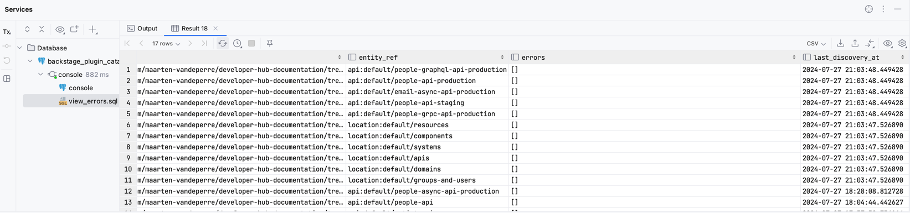
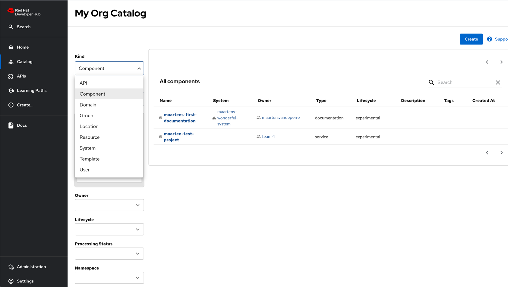
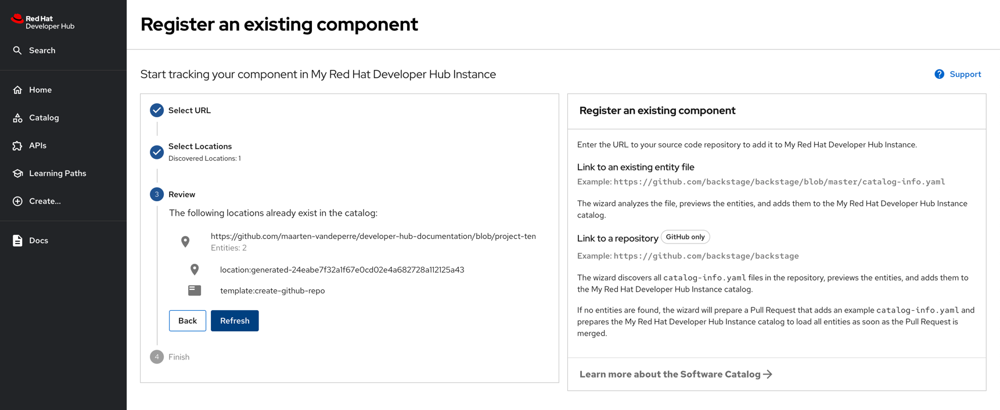
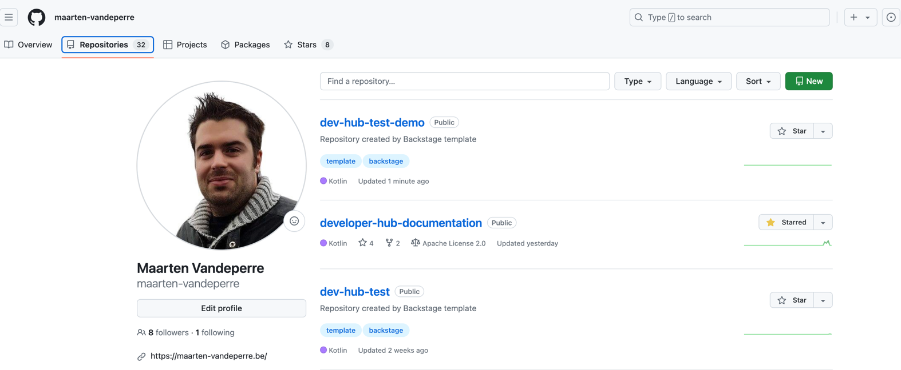

# Developer Hub Documentation

**_All actions will be executed within the 'demo-project' namespace on OpenShift, unless otherwise specified.
Next to that, be aware that the root domain will be different for you, and it will be the root domain of your
OpenShift cluster._**

## Table of Contents

1. [Install required tooling](#install-required-tooling)
    * [Keycloak](#keycloak)
    * [S3 (tech docs static content)](#s3-tech-docs-static-content)

2. [Install Red Hat Developer Hub](#install-red-hat-developer-hub)
    * [Install Red Hat Developer Hub via operator](#install-red-hat-developer-hub-via-operator)
    * [Install Red Hat Developer Hub via Helm chart](#install-red-hat-developer-hub-via-helm-chart)

3. [Debug Developer Hub](#debug-developer-hub)

4. [Configure Developer Hub](#configure-developer-hub)
    * [Create a backend secret](#create-a-backend-secret)
    * [Set the base domain variable](#set-the-base-domain-variable)
    * [Patch the secret](#patch-the-secret)
    * [Create the configuration config map](#create-the-configuration-config-map)
    * [Modify the Developer Hub instance manifest](#modify-the-developer-hub-instance-manifest)
    * [Access Developer Hub](#access-developer-hub)
    * [Enable dynamic plugins](#enable-dynamic-plugins)

5. [Developer Hub Configurations](#developer-hub-configurations)
    * [Enable authentication via Keycloak](#enable-authentication-via-keycloak)
    * [Enable tech docs to serve static content](#enable-tech-docs-to-serve-static-content)
    * [Add catalog entities manual](#add-catalog-entities--manual-)
    * [Distinguish in API definitions for different environments](#distinguish-in-api-definitions-for-different-environments)
    * [Enable and add software templates (GitHub)](#enable-and-add-software-templates--github-)
    * [Enable Component scanning (i.e., catalog entity) from GitHub](#enable-component-scanning--ie-catalog-entity--from-github)


## Install required tooling
This section will list tooling required to be set up if you would like to go through the entire demo.
Optional tools/components will be annotated with '*', meaning that, if you don't want to include them 
within your Developer Hub instance, you don't have to configure or install them.

Tools:
* **Keycloak**:  
Will be used for authentication (i.e., logging in) into Developer Hub.  
[Keycloak Installation Guide](README-InstallKeycloak.md)
* **S3 (tech docs static content)**:  
  Will be used to serve static content via Developer Hub.  
  [AWS S3 tech docs (static content) configuration](README-SetupAwsS3StorageForTechDocs.md)

## Install Red Hat Developer Hub
### Install Red Hat Developer Hub via operator
* Install the operator on OpenShift in the operator recommended namespace.
* Apply the following yaml:
```yaml
apiVersion: rhdh.redhat.com/v1alpha1
kind: Backstage
metadata:
  name: developer-hub
  namespace: demo-project
spec:
  application:
    appConfig:
      mountPath: /opt/app-root/src
    extraFiles:
      mountPath: /opt/app-root/src
    replicas: 1
    route:
      enabled: true
  database:
    enableLocalDb: true
```
* Wait for status to become "Deployed"
* Get the route to Developer Hub:
```shell
oc get route $(oc get routes -n demo-project -o jsonpath='{range .items[*]}{.metadata.name}{"\n"}{end}' | grep developer-hub) \
  -n demo-project \
  -o template --template='{{.spec.host}}'\ 
  ; echo
```
* _In our case: backstage-developer-hub-demo-project.apps.cluster-bnc5t.sandbox3269.opentlc.com_

### Install Red Hat Developer Hub via Helm chart
[Helm chart install guide](https://developers.redhat.com/learning/learn:openshift:install-and-configure-red-hat-developer-hub-and-explore-templating-basics/resource/resources:install-red-hat-developer-hub-developer-sandbox-red-hat-openshift)

## Debug Developer Hub
Not all error messages are popping up in the console log of the developer hub pods. In case you want to 
view them or in case you want to see when a configuration got reloaded by developer hub, you can make use 
of the underlying database.

In order to do so, you'll first need to enable port-forwarding to the postgres database:
```shell
oc port-forward $(oc get pod -n demo-project | grep backstage-psql | awk '{print $1}') 5432:5432 -n demo-project
```

Then you will need to fetch the root user and its password to connect to the database:
```shell
oc get secret backstage-psql-secret-developer-hub -n demo-project  -o template --template='{{.data.POSTGRES_USER}}' | base64 -d ; echo
oc get secret backstage-psql-secret-developer-hub -n demo-project  -o template --template='{{.data.POSTGRESQL_ADMIN_PASSWORD}}' | base64 -d ; echo
```

The database to be connected to, will be "backstage_plugin_catalog". If you're using IntelliJ,
it will look like this:


Now that we have a database connection, let's see how to request the possible errors and the 
reloading timestamps for the integrations (i.e., I use it as well during integration development to
validate when an update is processed).

You can run following query (or execute the [view logs script](sql/view_errors.sql)):
```sql
SELECT entity_id,
       location_key,
       entity_ref,
       errors,
       last_discovery_at AT TIME ZONE 'Europe/Brussels' AS last_discovery_at
FROM refresh_state
WHERE 1=1 -- dummy where clause to enable the "AND" clauses later on and play with commenting them out
-- AND last_discovery_at >= NOW() - INTERVAL '15 minutes'
AND last_discovery_at AT TIME ZONE 'Europe/Brussels' >= '2024-07-27 12:19:28.943856'
-- AND entity_ref = 'system:default/maartens-wonderful-system'
ORDER by last_discovery_at desc
;
-- Last discovery: 2024-07-27 12:13:23.515733
-- ==> only one record per entity_ref, which gets updated. No new record after an update,
-- so keep track of last one to check changes
```

Output will look like this:


If you want to experiment with it yourself, you can uncomment the line with _"#    - AI/ML #TODO enable this line if you want to try to debug for errors"_
within the catalog entities file [configurations/catalog-entities/systems/maartens-wonderful-system.yaml](configurations/catalog-entities/systems/maartens-wonderful-system.yaml).
  
You then should have the following error:


Full error message:

```text
Policy check failed for system:default/maartens-wonderful-system; 
caused by Error: \"tags.0\" is not valid; expected a string that is sequences of [a-z0-9+#] 
separated by [-], at most 63 characters in total but found \"AI/ML\". 
To learn more about catalog file format, visit: https://github.com/backstage/backstage/blob/master/docs/architecture-decisions/adr002-default-catalog-file-format.md
```

## Configure Developer Hub

* Create a backend secret (this is a mandatory secret), by applying the following yaml:
```yaml
kind: Secret
apiVersion: v1
metadata:
  name: rhdh-secrets
  namespace: demo-project
stringData:
  BACKEND_SECRET: averysecretpassword
type: Opaque
```
* Set the base domain variable.  
  **_!!! Be careful, the base domain will be different in your setup._**
```shell
basedomain=apps.cluster-bnc5t.sandbox3269.opentlc.com
```
* Patch the secret to add the base domain (i.e., to avoid CORS issues).  
```shell
oc patch secret rhdh-secrets -n demo-project -p '{"stringData":{"basedomain":"'"${basedomain}"'"}}'
```
* Configuration of Developer Hub is stored in a config map. This is what we are going to create via applying the following yaml:  
  **!! be aware**: project 'demo-project' is part of the url. Change it if you use another project
```yaml
kind: ConfigMap
apiVersion: v1
metadata:
  name: app-config-rhdh
  namespace: demo-project
data:
  app-config-rhdh.yaml: |
    app:
      title: My Red Hat Developer Hub Instance
      baseUrl: https://backstage-developer-hub-demo-project.${basedomain}
    backend:
      auth:
        keys:
          - secret: ${BACKEND_SECRET}
      baseUrl: https://backstage-developer-hub-demo-project.${basedomain}
      cors:
        origin: https://backstage-developer-hub-demo-project.${basedomain}
```
* Now we just have to change the manifest (i.e., instance description), in which we add a reference to the secrets file and the configuration, by applying the following yaml:  
_The yaml is already a modified version of the one mentioned above_
```yaml
apiVersion: rhdh.redhat.com/v1alpha1
kind: Backstage
metadata:
  name: developer-hub
  namespace: demo-project
spec:
  application:
    appConfig:
      mountPath: /opt/app-root/src
      configMaps: # added
        - name: app-config-rhdh # added
    extraFiles:
      mountPath: /opt/app-root/src
    extraEnvs:
      envs:
        # Disabling TLS verification
        - name: NODE_TLS_REJECT_UNAUTHORIZED
          value: '0'
      secrets: # added
        - name: rhdh-secrets # added
    replicas: 1
    route:
      enabled: true
  database:
    enableLocalDb: true
```
* Go to Developer Hub: _(in our case)_ backstage-developer-hub-demo-project.apps.cluster-bnc5t.sandbox3269.opentlc.com
* You should now be able to see the following screen:
  
* Last thing to configure now is the enablement of the dynamic plugins. These dynamic plugins will allow you to add functionality 
to Developer Hub without having to change the (React) source code (as it is done in the upstream Backstage project). For this we will
need to add an extra config map (i.e., dynamic plugin configuration) and link this configuration in the Developer Hub (instance) manifest.
  * Create the dynamic plugin configuration by applying the following yaml:
```yaml
kind: ConfigMap
apiVersion: v1
metadata:
  name: dynamic-plugins-rhdh
  namespace: demo-project
data:
  dynamic-plugins.yaml: |
    includes:
      - dynamic-plugins.default.yaml
#    plugins: leave this one out for now as it will give errors on startup (not needed at the moment anyway as we don't have plugins yet).
```
  * Link the configuration to the Developer Hub (instance) manifest by applying the following yaml:
```yaml
apiVersion: rhdh.redhat.com/v1alpha1
kind: Backstage
metadata:
  name: developer-hub
  namespace: demo-project
spec:
  application:
    dynamicPluginsConfigMapName: dynamic-plugins-rhdh # added
    appConfig:
      mountPath: /opt/app-root/src
      configMaps: 
        - name: app-config-rhdh 
    extraFiles:
      mountPath: /opt/app-root/src
    extraEnvs:
      envs:
        # Disabling TLS verification
        - name: NODE_TLS_REJECT_UNAUTHORIZED
          value: '0'
      secrets: 
        - name: rhdh-secrets # added
    replicas: 1
    route:
      enabled: true
  database:
    enableLocalDb: true
```

## Developer Hub Configurations

**_For the remainder (i.e. section [Developer Hub Configurations](#developer-hub-configurations)), we will expect to start
from a clean state as described at the end of section [Configure Developer Hub](#configure-developer-hub). In order to not have
conflicts when skipping sections, I will highlight the places where the config needs to be added as follows:_**  
_Adding this yaml_
```yaml
spec:
  presenter: maarten
``` 
_To this annotated template (on anchor_01)_
```yaml
config:
  metadata:
    name: demo-yaml
  <anchor_01>
```
_Would result in:_
```yaml
config:
  metadata:
    name: demo-yaml
  spec:
    presenter: maarten
```
_In case you get a second component to be added on anchor_01, let's say_
```yaml
spec:
  location: BeLux
```
_Then it would result in:_
```yaml
config:
  metadata:
    name: demo-yaml
  spec:
    presenter: maarten
    location: BeLux
```
_In case it would not be entirely clear, I will add the yaml definition which holds all the config 
of all listed components beneath in the respectively yaml files (i.e., yaml file name will map on the name of the config map)._

**Templates to start from:**
* **Developer Hub (instance) Manifest:**  
_Resulting file: [gitops/developer_hub/developer-hub-instance.yaml](gitops/developer_hub/31_developer-hub-instance.yaml)_
```yaml
apiVersion: rhdh.redhat.com/v1alpha1
kind: Backstage
metadata:
  name: developer-hub
  namespace: demo-project
spec:
  application:
    dynamicPluginsConfigMapName: dynamic-plugins-rhdh # added
    appConfig:
      mountPath: /opt/app-root/src
      configMaps: 
        - name: app-config-rhdh 
    extraFiles:
      mountPath: /opt/app-root/src
    extraEnvs:
      envs:
        # Disabling TLS verification
        - name: NODE_TLS_REJECT_UNAUTHORIZED
          value: '0'
      secrets: 
        - name: rhdh-secrets # added
    replicas: 1
    route:
      enabled: true
  database:
    enableLocalDb: true
```
* **Developer Hub Configuration**  
_Resulting file: [gitops/developer_hub/app-config-rhdh.yaml](gitops/developer_hub/11_app-config-rhdh.yaml)_  
**!! be aware**: project 'demo-project' is part of the url. Change it if you use another project
```yaml
kind: ConfigMap
apiVersion: v1
metadata:
  name: app-config-rhdh
  namespace: demo-project
data:
  app-config-rhdh.yaml: |
    <anchor_02>
    app:
      title: My Red Hat Developer Hub Instance
      baseUrl: https://backstage-developer-hub-demo-project.${basedomain}
    backend:
      auth:
        keys:
          - secret: ${BACKEND_SECRET}
      baseUrl: https://backstage-developer-hub-demo-project.${basedomain}
      cors:
        origin: https://backstage-developer-hub-demo-project.${basedomain}
    <anchor_03>
    <anchor_01>
```
* **Dynamic Plugin Configuration**  
_Resulting file: [gitops/developer_hub/dynamic-plugins-rhdh.yaml](gitops/developer_hub/21_dynamic-plugins-rhdh.yaml)_
```yaml
kind: ConfigMap
apiVersion: v1
metadata:
  name: dynamic-plugins-rhdh
  namespace: demo-project
data:
  dynamic-plugins.yaml: |
    includes:
      - dynamic-plugins.default.yaml
    <anchor_01>
```

### Enable authentication via Keycloak
* Make sure that Keycloak is set up as described in [Keycloak Installation Guide](README-InstallKeycloak.md)
  * Get the base url
  * Realm: rhdh
  * ClientId: rhdh-client
  * ClientSecret: view/copy it from keycloak
* Now we are going to configure OpenID (Keycloak for us) to allow OpenID-based authentication 
within Developer Hub. Apply the following yaml definition to the Developer Hub Config on anchor_01:
```yaml
auth:
  environment: development
  session:
    secret: ${BACKEND_SECRET}
  providers:
    oidc:
      development:
#        metadataUrl: <keycloak_base_url>/realms/rhdh/.well-known/openid-configuration # ${AUTH_OIDC_METADATA_URL}
        metadataUrl: https://demo-keycloak-instance.apps.cluster-bnc5t.sandbox3269.opentlc.com/realms/rhdh/.well-known/openid-configuration # ${AUTH_OIDC_METADATA_URL}
        clientId: rhdh-client # ${AUTH_OIDC_CLIENT_ID}
        clientSecret: 7iKyQUwyApIojzOlSj82vUWIhejv41E5 # ${AUTH_OIDC_CLIENT_SECRET}
        prompt: auto # ${AUTH_OIDC_PROMPT} # recommended to use auto
        ## uncomment for additional configuration options
        # callbackUrl: ${AUTH_OIDC_CALLBACK_URL}
        # tokenEndpointAuthMethod: ${AUTH_OIDC_TOKEN_ENDPOINT_METHOD}
        # tokenSignedResponseAlg: ${AUTH_OIDC_SIGNED_RESPONSE_ALG}
        # scope: ${AUTH_OIDC_SCOPE}
        ## Auth provider will try each resolver until it succeeds. Uncomment the resolvers you want to use to override the default resolver: `emailLocalPartMatchingUserEntityName`
        signIn:
          resolvers:
            - resolver: preferredUsernameMatchingUserEntityName
        #    - resolver: emailMatchingUserEntityProfileEmail
        #    - resolver: emailLocalPartMatchingUserEntityName
```
* By applying above config, you enable a new authentication provider to be used. By adding this info, the provider is not yet in use. 
In order to start using this oidc (i.e. OpenId Connect) provider, we have to apply the following yaml to the Developer Hub Config on anchor_02.
```yaml
signInPage: oidc  
```
* As a last step we need to make sure that the Keycloak users are synced with the Developer Hub's user catalog. In order to do so,
we need to:
  * Enable the dynamic plugin for Keycloak by applying the following yaml to the dynamic plugins configuration (on anchor_01):
```yaml
plugins:
  - package: ./dynamic-plugins/dist/janus-idp-backstage-plugin-keycloak-backend-dynamic
    disabled: false
    pluginConfig: {}
```
  * Apply the following yaml to the Developer Hub config (on anchor_03):
```yaml
catalog:
  providers:
    keycloakOrg:
      default:
        baseUrl: https://demo-keycloak-instance.apps.cluster-bnc5t.sandbox3269.opentlc.com
        loginRealm: rhdh # ${KEYCLOAK_REALM} TODO enable via secret
        realm: rhdh # ${KEYCLOAK_REALM} TODO enable via secret
        clientId: rhdh-client # ${KEYCLOAK_CLIENTID} TODO enable via secret
        clientSecret: 7iKyQUwyApIojzOlSj82vUWIhejv41E5 # ${KEYCLOAK_CLIENTSECRET} TODO enable via secret
        # highlight-add-start
        schedule: # optional; same options as in TaskScheduleDefinition
          # supports cron, ISO duration, "human duration" as used in code
          frequency: { minutes: 1 }
          # supports ISO duration, "human duration" as used in code
          timeout: { minutes: 1 }
          initialDelay: { seconds: 15 }
          # highlight-add-end
```
* Now the login screen should be changed to:
  

_If you now create groups and users within Keycloak's rhdh realm, they will 
become visible in Developer Hub: Catalog > Groups and Users._

### Enable tech docs to serve static content
* Make sure that S3 is set up as described in [AWS S3 tech docs (static content) configuration](README-SetupAwsS3StorageForTechDocs.md)
  * IAM user created that can read and write in S3
  * Bucket 'redhat-demo-dev-hub-1' in region 'eu-west-3'. 
* Make sure that the aws client (i.e., cli) is installed and that you logged in with the created user (i.e., run 'aws configure' command).
* Now we'll need to enable the tech docs plugin by applying the following yaml to the dynamic plugins configuration (on anchor_01):
```yaml
plugins:
  - package: ./dynamic-plugins/dist/backstage-plugin-techdocs-backend-dynamic
    disabled: false
    pluginConfig: {}
```
* When the dynamic plugin is enabled, we'll need to configure our developer hub instance to read from the correct bucket.
For that, we have to apply the following yaml to the Developer Hub Config on anchor_02:
```yaml
techdocs:
  builder: external
  generator:
    runIn: local
  publisher:
    type: 'awsS3'
    awsS3:
      bucketName: redhat-demo-dev-hub-1
      credentials:
        accessKeyId: <...>
        secretAccessKey: <...>
      region: eu-west-3
      s3ForcePathStyle: true
      sse: 'AES256'
```
* As documentation should not be rendered on the fly (according to the [recommended deployment model](https://backstage.io/docs/features/techdocs/architecture/)),
we need to make sure that information is fetched by the tech docs plugin (upfront),
by applying the following yaml to the dynamic plugins configuration (on anchor_03):
```yaml
catalog:
  providers:
   awsS3:
     default: # identifies your dataset / provider independent of config changes
       bucketName: redhat-demo-dev-hub-1
       #prefix: prefix/ # optional
       region: eu-west-3 # optional, uses the default region otherwise
       schedule: # same options as in TaskScheduleDefinition
         # supports cron, ISO duration, "human duration" as used in code
         #frequency: { minutes: 30 }
         frequency: { minutes: 1 }
         # supports ISO duration, "human duration" as used in code
         timeout: { minutes: 3 }
         initialDelay: { seconds: 15 }
```
* Now that we have our config set up, it's time to add/publish our documentation in S3. 
(You can describe the following process in e.g., GitHub actions as well):
  * Create a GIT repository in which you will store your static documentation (over here, a mimic of a GIT repository: [documentation/techdocs/static-content](documentation/techdocs/static-content)).
  * Static (source) content is available in the [documentation/techdocs/static-content](documentation/techdocs/static-content/docs) folder.  
  Important to note is that these should be **markdown files**.
  * Install [techdocs-cli](https://backstage.io/docs/features/techdocs/cli/)
  * Go to the root of your documentation repository ([documentation/techdocs/static-content](documentation/techdocs/static-content/docs))
  * Generate the content to be showed in Developer Hub:  
    ```shell
    techdocs-cli generate --no-docker --verbose
    ```
    Or run it from the root of this repository:
    ```shell
    techdocs-cli generate --source-dir ./documentation/techdocs/static-content --output-dir ./documentation/techdocs/static-content/site --no-docker --verbose
    ```
  * A folder 'documentation/techdocs/static-content/site' should be created now.
  * Validate that you have an active AWS session by running the following command:  
    _(redhat-demo-dev-hub-1)_ should be part of the list.
    ```shell
    aws s3 ls
    ```
  * Publish the static content to the S3 bucket by executing the following command:  
  **!! be aware:** If you change the component name (i.e., maartens-first-documentation), make sure that you change it as well 
  in catalog-info.yaml and mkdocs.yaml configuration files within the documentation repository, as they are linked to each other by name.
    ```shell
    techdocs-cli publish --publisher-type awsS3 \
          --storage-name redhat-demo-dev-hub-1 \
          --entity default/Component/maartens-first-documentation \
          --directory documentation/techdocs/static-content/site \
          --awsS3sse AES256
    ```
* We now have the configuration and the static content set up. We now only need to add it as a component in Developer Hub:
  * Open Developer Hub.
  * Click "create":
    
  * Add the URL of the catalog-info.yaml in the URL section (i.e., for me it is https://github.com/maarten-vandeperre/developer-hub-documentation/blob/tech-docs-implementation/documentation/techdocs/static-content/catalog-info.yaml).
  * Click on 'Analyze' and 'Create'.
  * Now go to "Docs" menu item and you should be able to see your documentation:
    

### Add catalog entities (manual)
In order to manually add catalog entities (i.e., not via integrations like the Keycloak binding), you will need to do two steps:
1. Define the catalog entities
2. Link them to the Developer Hub instance

#### Define the catalog entities
Catalog entities definitions are defined [over here](https://backstage.io/docs/features/software-catalog/descriptor-format/). I have added an example implementation
for all of them, which you can find back in the folder [configurations/catalog-entities](configurations/catalog-entities). If you want to link to them or import them, 
you can refer to the GitHub URL: https://github.com/maarten-vandeperre/developer-hub-documentation/tree/main/configurations/catalog-entities.

The main file, which groups everything together is the all.yaml locations file. It will delegate to other locations files, for a specific catalog entity type
(e.g., domains-location.yaml, groups-and-users-location.yaml). Feel free to have a look at the definition files and to extend them 
with your configuration(s). In case some modifications are not picked up, you can debug them as described in the [Debug Developer Hub Section](#debug-developer-hub).

When imported successfully, you can find them back in the catalog menu within Developer Hub:


The catalog graph as it is configured in my catalog-entities folder, results in the following catalog graph:

Without APIs for readability:


Without users for readability:


#### Link the catalog entities to the Developer Hub instance.
In order to link the catalog entities (i.e., defined in previous section) to Developer Hub, you'll need to apply the 
following yaml to the Developer Hub Config on anchor_02:
```yaml
catalog:
  processingInterval: { minutes: 1 }
  processing:
    cache:
      enabled: false
  lifecycles:
    - production
    - staging
  rules:
    - allow: [Location, Component, API, Resource, System, Domain, Group, User, Template]
  locations: 
    - rules:
        - allow:
            - Group
            - User
            - Component
            - Location
            - System
            - Resource
            - Domain
            - API
            - Template
      target: https://github.com/maarten-vandeperre/developer-hub-documentation/blob/main/configurations/catalog-entities/all.yaml
      type: url
```

If you want to see it in a complete configuration file, feel free to have a look at [gitops/developer-hub/11_app-config-rhdh.yaml](gitops/developer-hub/11_app-config-rhdh.yaml), 
which contains all the integrations, described in this README file.

**!!! Have a close look to the API definitions:** I added both production and staging OpenAPI definitions, as in the real world,
API definitions can differ, depending on the given environment.

### Distinguish in API definitions for different environments
See section [Link the catalog entities to the Developer Hub instance](#link-the-catalog-entities-to-the-developer-hub-instance).

### Enable and add software templates (GitHub)
In order to enable software templates (for GitHub), the only thing you'll need to do, is configuring a GitHub application that has the permission to 
create Git repositories (see [How to configure GitHub applications](README-ConfigureGithubApplication.md)). 

Make sure you have the values for the following fields:
* Personal Access Token (not GitHub application related, but user bound).
* Application ID
* Application's Client ID
* Application's Client Secret
* Application's Private Key

If you are not making use of the script_init_cluster script, you will need to add it to a config map. 
A config map template can be found in secrets/raw/secret_github_integration. If you make use of the 
script_init_cluster script, then it will be asked upon startup (and be places in the secrets/generated folder).

Now that we have the values in our config map, we'll need to add the config map to the developer hub instance definition
configuration like this (_rhdh-secrets should already be there_):

```yaml
  secrets:
    - name: rhdh-secrets # added
    - name: rhdh-secrets-github-integration
```

Now, add a GitHub integration configuration by applying the following yaml to the Developer Hub Config on anchor_02:
```yaml
integrations:
  github:
    - host: github.com
      token: ${RHDH_GITHUB_INTEGRATION_PERSONAL_ACCESS_TOKEN}
      apps:
        - appId: ${RHDH_GITHUB_INTEGRATION_APP_ID}
          clientId: ${RHDH_GITHUB_INTEGRATION_APP_CLIENT_ID}
          clientSecret: ${RHDH_GITHUB_INTEGRATION_APP_CLIENT_SECRET}
          webhookUrl: none
          webhookSecret: none
          privateKey: ${RHDH_GITHUB_INTEGRATION_APP_PRIVATE_KEY}
```
_Note: I am adding the personal access token over here, mainly because I am lazy. You can make it a part of the software template's input parameters as well.
Difference in between the two solutions: in this solution you'll need some kind of system user account to be bound to developer hub, if you ask it in the 
software template, it will be bound to the user who initiated the template._

If you want to see it in a complete configuration file, feel free to have a look at [gitops/developer-hub/11_app-config-rhdh.yaml](gitops/developer-hub/11_app-config-rhdh.yaml),
which contains all the integrations, described in this README file.

Now we need to add the software template, for this we will go to the "create..." menu item and
follow the following steps:
1. Click on the button "Register Existing Component".
2. Fill the following URL and click analyze: https://github.com/maarten-vandeperre/developer-hub-documentation/tree/main/configurations/software-templates/simple-hello-world/template.yaml

3. Click "refresh" button.
4. No need to click "Register another", you can just click the "create..." menu item again
and the template should be visible now:


**A software template is defined by**
* A GitHub (submodule in) repository. In my example: https://github.com/maarten-vandeperre/developer-hub-documentation/tree/main/configurations/software-templates/simple-hello-world
* A template.yaml file which defines the catalog entity type "Template"
  (See section [Define the catalog entities](#define-the-catalog-entities)).
* Most of the time a skeleton folder (unless defined differently in the template.yaml file),
which contains the source code. This code can be parameterized: check e.g., skeleton/catalog-info.yaml,
which is using the name and owner field, which are defined in the template.yaml file and initiated during
template initiation.

**Initiating the software template**
When you have the catalog with the templates, pick the template you want to initiate and
click "Choose".


Now you can initiate the template. I use the following values:
* Repository name: dev-hub-test-demo
* Name: dev-hub-test-demo
* Owner: maarten-vandeperre-org

Click "Review" and click "Create", and you should be able to see the link to the new repository
or you will see it in GitHub:




### Enable Component scanning (i.e., catalog entity) from GitHub
In order to enable software templates (for GitHub), the only first thing you'll need to do, is configuring a GitHub application that has the permission to
create Git repositories (see [How to configure GitHub applications](README-ConfigureGithubApplication.md)).

In order to enable component scanning from GitHub to Developer Hub (i.e., catalog entity type Component), 
you'll need to execute the following steps:
1. Enable the Catalog Backend Module GitHub plugin by applying the following yaml to the dynamic plugins configuration (on anchor_01):
    ```yaml
    - package: ./dynamic-plugins/dist/backstage-plugin-catalog-backend-module-github-dynamic
      # documentation: https://backstage.io/docs/integrations/github/discovery/
      disabled: false
      pluginConfig: {}
    ```
2. Add a provider, which scans your GitHub repositories every x time and creates or updates
Component definitions in Developer Hub by applying the following yaml to the Developer Hub Config on anchor_02:
    ```yaml
    catalog:
      providers:
        github:
          # the provider ID can be any camelCase string
          providerId:
            organization: 'maarten-vandeperre' # string
            catalogPath: '/catalog-info.yaml' # string
            filters:
              branch: 'master' # string
              repository: '.*' # Regex
            schedule: # optional; same options as in TaskScheduleDefinition
              # supports cron, ISO duration, "human duration" as used in code
              frequency: { minutes: 1 }
              # supports ISO duration, "human duration" as used in code
              timeout: { minutes: 1 }
              initialDelay: { seconds: 15 }
    ```
   
    Most important configurations:
    * catalogPath: the catalog entity Component type definition, which describes the given component.
    * filters > branch: branch to look at.
    * repository: I will scan all my repositories, so I add a regular expression, covering everything.

   If you want to see it in a complete configuration file, feel free to have a look at [gitops/developer-hub/11_app-config-rhdh.yaml](gitops/developer-hub/11_app-config-rhdh.yaml),
   which contains all the integrations, described in this README file.
3. Add a GitHub integration configuration by applying the following yaml to the Developer Hub Config on anchor_02:
    ```yaml
    integrations:
      github:
        - host: github.com
          token: ${RHDH_GITHUB_INTEGRATION_PERSONAL_ACCESS_TOKEN}
          apps:
            - appId: ${RHDH_GITHUB_INTEGRATION_APP_ID}
              clientId: ${RHDH_GITHUB_INTEGRATION_APP_CLIENT_ID}
              clientSecret: ${RHDH_GITHUB_INTEGRATION_APP_CLIENT_SECRET}
              webhookUrl: none
              webhookSecret: none
              privateKey: ${RHDH_GITHUB_INTEGRATION_APP_PRIVATE_KEY}
    ```
   _Note: The token is optional, but if you don't configure it, you'll run rather fast against GitHub API rate limits. So I would advise to have 
some kind of system user account in place to link to the catalog scanning configuration._
    
    If you want to see it in a complete configuration file, feel free to have a look at [gitops/developer-hub/11_app-config-rhdh.yaml](gitops/developer-hub/11_app-config-rhdh.yaml),
    which contains all the integrations, described in this README file.
4. Now you should be able to see the repositories in your GitHub account that have a
Component definition (i.e., catalog-info.yaml file) in their root. If for some reason it is not
popping up, try as well the console log for debugging ends or [check the database](#debug-developer-hub).